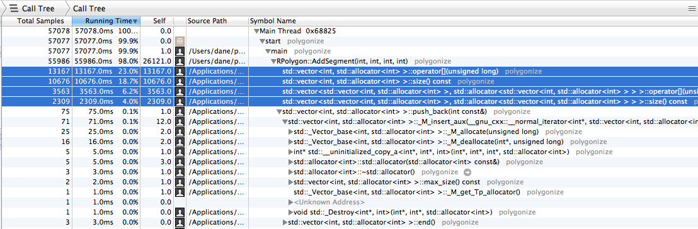
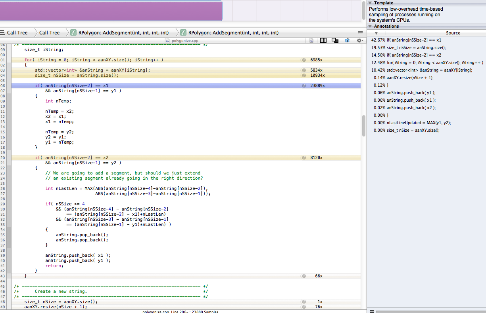

## Depends

 - C++ compiler
 - GDAL
 - XCode with Instruments.app

## Usage

Build and test:

    make
    make test

Wait for a bit and then Instruments will open.

Check out the callgraph. Click on the line `AddSegment` to get a display of where the time is being taken within that function.

